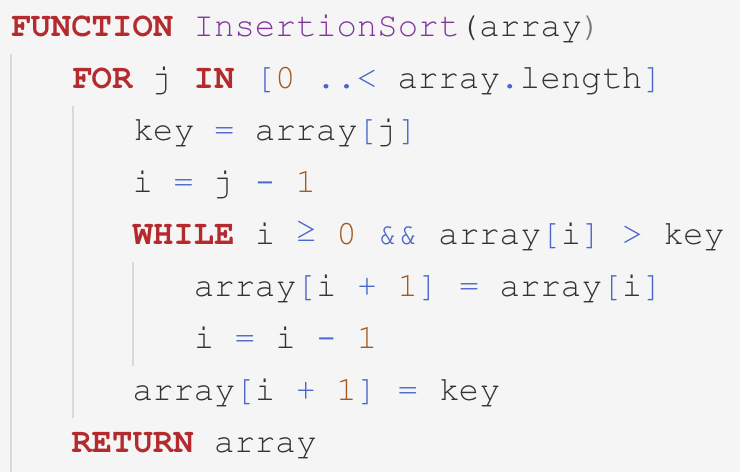

# vscode-pseudocode

A simple psuedocode based for creating lecture slides.



## Usage

```bash
# Loading the plugin without installing as an extension
ln -s ~/path/to/this/vscode-pseudocode ~/.vscode/extensions/vscode-pseudocode
```

I picked selectors based on colors for the "Quiet Light" theme.

I use the following Visual Studio Code language specific settings, which help me copy and paste into PowerPoint.

```json
"[pseudocode]": {
  "editor.fontFamily": "Consolas, 'Courier New', monospace",
  "editor.insertSpaces": false,
  "editor.tabSize": 3,
  "editor.rulers": [
    54
  ]
},
```

## Resources

- [Gaddis Pseudocode Wiki](https://en.wikiversity.org/wiki/Pseudocode/Gaddis_Pseudocode)
- [Visual Studio Code Syntax Guide](https://code.visualstudio.com/api/language-extensions/syntax-highlight-guide)

